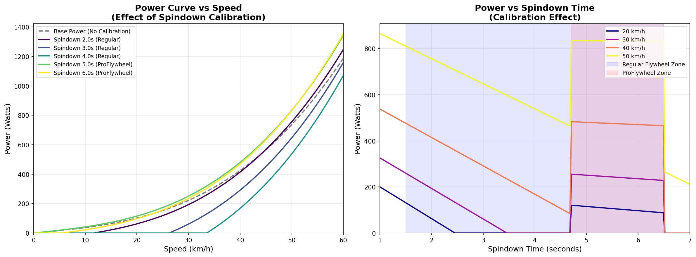

# Kinetic Fit - Decompiled APK

This repository contains the decompiled source code of the Kinetic Fit Android application, with modifications to bypass login requirements and enable offline use.

## 🚀 Quick Start

**For most users**: Download the pre-built APK from the [Releases page](https://github.com/yourusername/kinetic-fit/releases) and install it on your Android device.

**For developers**: See the "Rebuilding the APK" section below.

## 📱 Project Information

- **Package Name**: `com.kinetic.fit`
- **Version**: 1.4.23 (versionCode: 220)
- **Original APK**: `kinetic-fit.apk`
- **Min SDK Version**: 21 (Android 5.0 Lollipop)
- **Target SDK Version**: 28 (Android 9.0 Pie)
- **Decompiled Using**: apktool 2.7.0

## 🎯 Why I Need This App

I have a **Kinetic T-6400** trainer, and the official Kinetic Fit app has been removed from Google Play. While other platforms (like MyWhoosh, Zwift, etc.) can perform calibration, they don't show the **spindown time in seconds** - which is crucial for making accurate adjustments to match my power meter readings.

This app allows me to:
- See the exact spindown time (in seconds) after calibration
- Make precise adjustments to roller tension
- Compare trainer power with my power meter
- Fine-tune the calibration for better accuracy

## 🔬 Understanding Spindown Calibration

### What is Spindown Calibration?

As explained by Jason from Kinetic:

> "Spindown calibration is to determine the rolling resistance created by the tire and roller, not about the circumference of the wheel. It adjusts the power curve based on that result."

### How Spindown Affects Power

The trainer calculates power using a formula that includes a **spindown correction factor**. This correction adjusts the base power curve based on your measured rolling resistance:

1. **Base Power**: `P_base = 5.24482 × v_mph + 0.019168 × v_mph³`
   - Calculated from speed alone

2. **Spindown Correction**: Applied based on your measured spindown time
   - **Regular Flywheel** (1.5-6.5s): Different correction formula
   - **ProFlywheel** (4.7-6.5s): Different correction formula

3. **Final Power**: `P_final = P_base + correction`

### Power Curve Visualization

The spindown time significantly affects the power curve at all speeds. Here's how different spindown times change the power readings:



**Key Observations:**
- **Faster spindown** (1.5-3.0s) = Higher rolling resistance = **Lower power readings** (negative correction)
- **Slower spindown** (4.7-6.5s) = Lower rolling resistance = **Higher power readings** (positive correction)
- The correction affects **all speeds**, not just one point

### Spindown Time Interpretation

- **Fast Spindown (1.5-3.0s)**: High rolling resistance
  - Tire not properly inflated
  - High tire-to-roller friction
  - Results in **lower power** readings

- **Medium Spindown (3.0-4.7s)**: Normal rolling resistance (Regular flywheel)
  - Typical trainer setup
  - Balanced power readings

- **Slow Spindown (4.7-6.5s)**: Low rolling resistance (ProFlywheel)
  - Well-inflated tire
  - Smooth roller
  - Results in **higher power** readings

**Why This Matters**: By knowing your exact spindown time, you can make informed adjustments to tire pressure and roller tension to achieve better power meter matching.

## 📖 My Calibration Experience

Here's my step-by-step process for calibrating my Kinetic T-6400:

### Step 0: Why I Need This App
I have a Kinetic T-6400, and the app is no longer available on Google Play. Other platforms (like MyWhoosh) can do calibration, but they don't show the spindown time in seconds. I need this app to see the exact spindown time so I can make accurate adjustments to match my power meter.

### Step 1: Initial Setup
- Pumped my bike tire to **100 PSI**
- Tightened the roller knob until it just touches the tire
- Then tightened **3 more full rotations**

### Step 2: First Spindown Test
- Performed spindown calibration in the app
- Result: **5.68 seconds**

### Step 3: Power Meter Comparison
- Compared trainer power vs. my power meter:
  - At low power: Trainer **60W** vs. Power meter **45W** (trainer reads higher)
  - At high power: Trainer **180W** vs. Power meter **160W** (trainer reads higher)
- **Conclusion**: The trainer is reading harder than real-world (higher power)

### Step 4: First Adjustment
- **Loosened the knob by 1/5 rotation** (to reduce friction)
- Goal: Reduce rolling resistance to lower power readings

### Step 5: Problem Encountered
- Redid spindown calibration
- **Issue**: Tire started **slipping when applying high torque**
- This indicates the roller tension was too loose

### Step 6: Final Adjustment
- **Tightened the knob by 2/5 rotation** (net: +1/5 from original)
- Redid spindown calibration
- Result: **6.48 seconds** (slower spindown = less resistance)

### Final Thoughts

Despite multiple adjustments, the power still couldn't perfectly match my power meter. This is common with trainer calibration - achieving perfect accuracy is difficult due to:
- Mechanical losses in the drivetrain
- Tire type and condition variations
- Roller wear and condition

**My Solution**: I now use my **power meter as the primary power source** and the **trainer as secondary/controllable**. This gives me accurate power readings while still allowing the trainer to control resistance in apps like MyWhoosh.

**Reference**: For more detailed calibration procedures, see this excellent article on [Wahoo KICKR Snap Spin Down Calibration](https://kidsandcowbells.wordpress.com/2016/12/12/wahoo-kickr-snap-spin-down-calibration/) - the principles apply to Kinetic trainers as well.

## 🔓 Login Bypass Modifications

This repository includes modifications to bypass the login requirement, as the original company has defunct and authentication servers are no longer available. These changes allow the app to function without requiring server-side authentication.

### Modifications Made

#### 1. Login Dispatch Activity (`smali_classes2/com/kinetic/fit/ui/login/LoginDispathActivity.smali`)
- **Modified `runDispatch()` method**: Now bypasses both login and synchronization screens
- **Added `getRootIntent()` method**: Creates intent to directly launch RootActivity
- **Result**: App launches directly to the main interface, skipping authentication

#### 2. Profile Class (`smali_classes2/com/kinetic/fit/data/realm_objects/Profile.smali`)
- **Modified `current()` method**: Automatically creates a mock "admin" user profile if none exists in the Realm database
  - Creates profile with username: "admin"
  - Email: "admin@kinetic.fit"
  - Session token: "admin-token"
- **Modified `getCurrentName()` method**: Returns "admin" as default when no profile exists
- **Modified `getMainEmail()` method**: Returns "admin@kinetic.fit" as default when no profile exists

### How It Works

1. On app launch, `LoginDispathActivity` is the entry point
2. Instead of checking for authentication and routing to login or sync screens, it now directly navigates to `RootActivity`
3. When the app queries for user profile information:
   - If no profile exists in the Realm database, an admin profile is automatically created
   - Profile getter methods return admin values as fallbacks
4. User profile synchronization is bypassed entirely

### Testing Results

✅ **Verified Working**:
- App launches successfully without login screen
- Bypasses authentication and synchronization screens
- Opens directly to main interface (RootActivity)
- Admin profile is automatically created
- Spindown calibration works correctly
- Spindown time is displayed in seconds

⚠️ **Known Issues**:
- **Bluetooth Device Detection**: Some Bluetooth trainer devices (e.g., Kinetic T-6400, shown as 'Kinetic 3D:FD' in Bluetooth settings) may not appear in the app's device list even when connected via phone Bluetooth settings. This may be due to:
  - Missing or incompatible BLE (Bluetooth Low Energy) service discovery
  - Device pairing requirements that differ from standard Bluetooth pairing
  - App-specific device filtering or discovery protocols
  
  **Workaround**: The device may need to be discovered/paired directly through the app's sensor discovery feature rather than through system Bluetooth settings.

## 🛠️ Rebuilding the APK

If you need to rebuild the APK from this decompiled source:

```bash
# Install apktool (if not already installed)
# Download from: https://ibotpeaches.github.io/Apktool/

# Build APK (NOTE: Must use --use-aapt2 flag)
apktool b . -o kinetic-fit-bypass.apk --use-aapt2

# Sign the APK (required for installation)
# Option 1: Create a new keystore
keytool -genkey -v -keystore my-release-key.keystore -alias kinetic-fit -keyalg RSA -keysize 2048 -validity 10000

# Option 2: Use debug keystore (for testing)
jarsigner -verbose -sigalg SHA1withRSA -digestalg SHA1 -keystore ~/.android/debug.keystore kinetic-fit-bypass.apk androiddebugkey
# Password: "android"

# Align the APK (optional but recommended)
zipalign -v 4 kinetic-fit-bypass.apk kinetic-fit-bypass-aligned.apk
```

### Build Fixes Applied

#### Resource File Names
- **Fixed invalid resource filenames**: Renamed drawable files containing `$` characters to comply with Android resource naming rules
  - `$avd_hide_password__0.xml` → `avd_hide_password__0.xml`
  - `$avd_hide_password__1.xml` → `avd_hide_password__1.xml`
  - `$avd_hide_password__2.xml` → `avd_hide_password__2.xml`
  - `$avd_show_password__0.xml` → `avd_show_password__0.xml`
  - `$avd_show_password__1.xml` → `avd_show_password__1.xml`
  - `$avd_show_password__2.xml` → `avd_show_password__2.xml`
- **Updated resource references**: Fixed references in:
  - `res/values/public.xml` - Updated public resource declarations
  - `res/drawable/avd_hide_password.xml` - Updated drawable references
  - `res/drawable/avd_show_password.xml` - Updated drawable references

#### Build Tool Requirements
- **Must use `--use-aapt2` flag**: The build requires `aapt2` instead of the older `aapt` tool due to resource compilation issues
- **aapt2 availability**: Ensure `aapt2` is installed and available in your PATH (usually comes with Android SDK build-tools)

### Build Notes

⚠️ **Important**: The build process requires the `--use-aapt2` flag. Without it, the build will fail with resource compilation errors. This is due to compatibility issues between the decompiled resources and the older `aapt` tool.

### Installation

**Signing the APK**:
```bash
# Create debug keystore (if not exists)
keytool -genkey -v -keystore ~/.android/debug.keystore -alias androiddebugkey -keyalg RSA -keysize 2048 -validity 10000 -storepass android -keypass android -dname "CN=Android Debug,O=Android,C=US"

# Sign the APK
jarsigner -verbose -sigalg SHA256withRSA -digestalg SHA-256 -keystore ~/.android/debug.keystore -storepass android -keypass android kinetic-fit-bypass.apk androiddebugkey

# Verify signature
jarsigner -verify kinetic-fit-bypass.apk
```

**Installing on Device**:
```bash
# If previous version exists with different signature, uninstall first
adb uninstall com.kinetic.fit

# Install the new APK
adb install kinetic-fit-bypass.apk
```

**Note**: If you get `INSTALL_FAILED_UPDATE_INCOMPATIBLE`, the existing app was signed with a different key. Uninstall the old version first, then install the new one.

## 📂 Project Structure

```
kinetic-fit/
├── AndroidManifest.xml          # Application manifest
├── apktool.yml                  # Apktool configuration
├── res/                         # Android resources (layouts, drawables, values)
├── smali/                       # Dalvik bytecode (smali format)
├── smali_classes2/              # Additional Dalvik bytecode classes
├── smali_classes3/              # Additional Dalvik bytecode classes
├── lib/                         # Native libraries (JNI)
│   ├── arm64-v8a/
│   ├── armeabi-v7a/
│   ├── mips/
│   ├── x86/
│   └── x86_64/
├── assets/                      # Raw asset files
├── kotlin/                      # Kotlin metadata files
├── META-INF/                    # Metadata and service definitions
└── original/                    # Original manifest and metadata
```

## 🔧 Requirements

To work with this decompiled APK, you'll need:

- **Java Development Kit (JDK)** 8 or higher
- **Android SDK** with platform-tools
- **Apktool** 2.7.0 or compatible version
- **Build tools** for Android SDK 28

## 📋 Features

Based on the manifest and code structure, this application includes:

- **Fitness Tracking**: Activity and workout tracking
- **Bluetooth LE Support**: Device connectivity (requires BLE hardware)
- **Spindown Calibration**: Accurate calibration with spindown time display
- **Google Play Services Integration**: Maps, location, fitness APIs
- **Cloud Sync**: Data synchronization services (disabled in this version)
- **Cast Support**: Google Cast integration
- **Zendesk Integration**: Customer support
- **Crashlytics**: Crash reporting via Fabric

## 📚 Additional Documentation

For more detailed information, see:

- **`CALIBRATION_ANALYSIS.md`** - Complete technical analysis of the spindown calibration algorithm
- **`CALIBRATION_FAQ.md`** - FAQ covering common calibration questions
- **`SPINDOWN_TROUBLESHOOTING.md`** - Troubleshooting guide for calibration issues
- **`POWER_DISCREPANCY_ANALYSIS.md`** - Analysis of power meter vs. trainer discrepancies
- **`SPINDOWN_TIME_SUMMARY.md`** - Summary of spindown time ranges by trainer model

## ⚠️ Legal Notice

This decompiled source code is provided for **educational and research purposes only**. 

- **Do not** redistribute the original application or modified versions without proper authorization
- **Respect** the original developer's intellectual property rights
- **Do not** use this code for commercial purposes without licensing
- **Comply** with the original application's terms of service and license agreements

The decompilation and analysis of Android applications should only be performed on:
- Applications you own
- Applications you have explicit permission to reverse engineer
- Applications for security research with proper authorization

## 🔐 Permissions

This application requests the following permissions:

- Location (coarse)
- Internet
- Bluetooth & Bluetooth Admin
- External Storage (read/write)
- Network State
- Wake Lock
- Vibration
- Accounts
- Foreground Service
- Billing (in-app purchases)

## 📚 Libraries & Dependencies

The application uses several libraries including:

- **AndroidX** libraries (AppCompat, Material Design, etc.)
- **Google Play Services** (Fitness, Maps, Location, etc.)
- **Retrofit** & **OkHttp** for networking
- **Dagger** for dependency injection
- **Kotlin** standard library
- **Crashlytics** for crash reporting
- **Zendesk** for customer support

## 🤝 Contributing

This is a decompiled project. Contributions that improve documentation, analysis, or educational value are welcome. However, please ensure any contributions comply with legal and ethical guidelines.

## 📄 License

This repository contains decompiled code from a proprietary application. The original application's license terms apply. This repository is for educational purposes only.

---

**Disclaimer**: This repository does not claim ownership of the original application or its code. All rights belong to the original developers and publishers.
